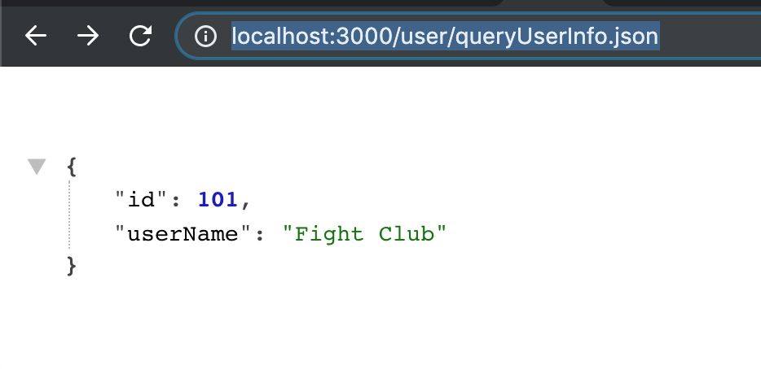

### 前言

**如果没有了后台开发的 API 接口, 前端如何自己写呢, mock 数据是一种方式, 但也有了解或者掌握更多的 NodeJS 作为后台开发的必要**
[**后台服务测试 github**](https://github.com/niexiaofei1988/node-ts-server)**: 未完**
[**前台静态资源 github**](https://github.com/niexiaofei1988/React-Typescript)**: 未完**

### 选择

**虽然在 github 甚至博客上出现更多的 nodejs 框架是 **[**express**](https://expressjs.com/)**,  但也想尝试用下 **[**koa**](https://koajs.com/)** , 无论简单或复杂, 无论是成功或失败, 至少需要有了解及掌握的心**
**使用 **[**NodeJs**](https://nodejs.org/en/)**(最新版本 ^12.5)  + **[**koa**](https://koajs.com/)** (v2) + **[**mongodb**](https://www.mongodb.com/)** 等搭建一个简易的 **[**Restful api**](https://restfulapi.net/)

### Part1

```bash
npm init -y

# koa
npm i --save koa

# chalk
npm i --save -dev chalk
```

**安装好之后就可以开始了**
`**新建 config.js(配置项)**`

```javascript
// config.js
module.exports = {
	port: process.env.NODE_PORT || 3000,
};
```

`**新建 index.js (作为启动入口)**`

```ts
const Koa = require('koa');
const http = require('http');
const chalk = require('chalk');
const config = require('./config');

// 创建实例
const app = new Koa();

app.use(async (ctx) => {
	ctx.body = 'Hello Koa!';
});

// 错误处理
app.on('error', (err) => {
	console.log(chalk.bgBlue('server error', err));
});

const server = http.createServer(app.callback());

server.listen(config.port, () => {
	console.log(`server is running on
		 ${chalk.blue.bold(`
      Local: http://localhost:${config.port}
    `)}
	`);
});
```

`**修改 package.json**`

```json
"scripts": {
	"start": "node index.js"
}
```

**启动**

```bash
npm start
```

**到此当你看到了 server is running on Local: **[**http://localhost:3000**](http://localhost:3000)**, 打开如果看到 Hello Koa! 时就表示第一步已经完成了, 是不是心里感觉 wo ca 这么简单? 没错, 别人封装好的东西既好用又简单, 不需要考虑那么多**

---

### Part2

是不是感觉每次修改都需要重新的关闭服务 启动服务比较麻烦 ? 当然也有方法可以实时的监控文件修改执行热更新,这里选择的是 [**nodemon**](https://nodemon.io/)**, 也会感觉到使用 require(导入) 和 module.exports(导出)的方法写的有点不爽, 想用 ES6 的方法, 官网也有**[**提供方法使用 babel**](https://koa.bootcss.com/#introduction)**, 但为了后续的想要使用 ts, 这里采用 **[**ts-node**](https://github.com/TypeStrong/ts-node)** 的方法, 既然已经引出了 ts, 就将 ts 的配置一块配置了吧**

```bash
npm install --save-dev nodemon typescript ts-node @types/koa
```

**修改启动脚本 package.json**

```json
"script": {
	"start": "nodemon --exec ./node_modules/.bin/ts-node -- ./index.ts",
}
```

**修改启动入口为 TS. 是不是看着舒服多了 ?**

```typescript
// config.ts
export interface Iconfig {
	port: string | number;
	prettyLog: boolean;
}

export const config: Iconfig = {
	port: process.env.NODE_PORT || 3000,
	prettyLog: process.env.NODE_ENV === 'development',
};

// index.ts
import Koa from 'koa';
import http from 'http';
import chalk from 'chalk';
import { config } from './config';

const app = new Koa();

app.on('error', (err: any) => {
	console.log(chalk.bgBlue('server error', err));
});

const server = http.createServer(app.callback());
server.listen(config.port);

server.on('listening', () => {
	console.log(`server running on
    ${chalk.blue.bold(`
      Local: http://localhost:${config.port}
    `)}
  `);
});
```

**配置 tsconfig.json**

```json
{
	"compilerOptions": {
		/* Basic Options */
		"target": "ESNEXT",
		"module": "commonjs",
		"allowJs": true,
		"resolveJsonModule": true,
		"sourceMap": true,
		"outDir": "./dist",
		/* Strict Type-Checking Options */
		"strict": true,
		"noImplicitAny": true,
		"typeRoots": ["../../typings", "../../node_modules/@types"],
		"allowSyntheticDefaultImports": true,
		"esModuleInterop": true
	}
}
```

**第二部分的作用主要是为了能够使用 ES6 的语法, 并没有进行太大的改造, 或许是看着舒服或者使用起来更加方便和简洁吧, 添加 node 程序实现热刷新**

---

### Part3

**这一部分主要是添加 **[**koa-router**](https://github.com/ZijianHe/koa-router)**, 这也是实现 Restful api 的重要一步, 根据文档使用起来比较方便简单, 从此步开始就要对文件的管理进行优化**

- [x] **新建  controllers 用来管理实现 查询的文件**

```typescript
// controllers/user.ts
const userList = [
	{ id: 101, userName: 'Fight Club' },
	{ id: 102, userName: 'Sharp Objects' },
	{ id: 103, userName: 'Frankenstein' },
	{ id: 101, userName: 'Into The Wild' },
];

// 新增
export async function addUser(ctx: any, next: any) {
	ctx.body = 'success';
	await next();
}

// 查询用户信息
export async function queryUserInfo(ctx: any, next: any) {
	ctx.body = JSON.stringify(userList[0]);
	next();
}

// 获取所有用户
export async function getAllUserList(ctx: any, next: any) {
	ctx.body = userList;
	next();
}

// 登录
export async function login(ctx: any, next: any) {
	ctx.body = '111';
	next();
}
```

- [x] **新建 routes/user.ts 实现一个简单的 user 的路由查询**

```typescript
// routes/user.ts
import Router from 'koa-router';
import { queryUserInfo, getAllUserList, addUser, login } from '../controllers/user';

// 添加前缀
const router = new Router({
	prefix: '/user',
});

router.post('/login.json', login);
router.post('/addUser.json', addUser);
router.get('/list.json', getAllUserList);
router.get('/queryUserInfo.json', queryUserInfo);

export default router.routes();
```

**需要修改下原来的 index.ts 文件**

```typescript title=index.ts
// index.ts
// .... 省略以上代码
import userRoutes from './routes/userRouter';

app.use(userRoutes);
```

**当以上步骤完成之后, 因为已经添加了热更新, 所以不需要重新启动, 此时访问**[**http://localhost:3000/user/queryUserInfo.json**](http://localhost:3000/user/queryUserInfo.json)** , 当看到以下图时说明已经修改成功了, 到此时虽然几个添加的接口地址都可以访问了, 但是并不能用于前后端分离时的访问, 这是为什么呢, 因为没设置跨域, 需要添加 **[**koa2-cors**](https://github.com/zadzbw/koa2-cors#readme)**, 对于 post 请求的解析需要配合 **[** koa-bodyparser**](https://github.com/koajs/bodyparser)** 直接安装使用即可,目前用不到其他的设置**

```bash
npm i --save koa2-cors koa-bodyparser
```

```typescript
// 修改 index.ts 并省略以上代码
import cors from 'koa2-cors';
import bodyParser from 'koa-bodyparser';

app.use(
	cors({
		origin: '*', // 允许任何网站访问
		exposeHeaders: ['Authorization'],
		credentials: true,
		allowMethods: ['GET', 'PUT', 'POST', 'DELETE'], // 允许的方法
		allowHeaders: ['Authorization', 'Content-Type'], // 允许的headers
		// keepHeadersOnError: true,
	}),
);

// 配置项可以先不添加
app.use(bodyParser({}));
```


**到此就先告一段落, 未完待续**

---

### 参考

- [**koa api**](https://devdocs.io/koa/)
- [**start building web apps with koajs and typescript**](https://medium.com/netscape/start-building-web-apps-with-koajs-and-typescript-366264dec608)
- [**使用 ts 和 nodejs 搭建 koa 应用**](https://www.jianshu.com/p/1a91f36e5153)
- [**realworld**](https://github.com/gothinkster/realworld)\*\*  **[**medium\*\*](https://medium.com/@ericsimons/introducing-realworld-6016654d36b5)
- [restful.zip](https://www.yuque.com/attachments/yuque/0/2020/zip/106721/1589648678398-b25e290c-ae35-492c-93cd-d262d282629f.zip?_lake_card=%7B%22src%22%3A%22https%3A%2F%2Fwww.yuque.com%2Fattachments%2Fyuque%2F0%2F2020%2Fzip%2F106721%2F1589648678398-b25e290c-ae35-492c-93cd-d262d282629f.zip%22%2C%22name%22%3A%22restful.zip%22%2C%22size%22%3A17816954%2C%22type%22%3A%22application%2Fzip%22%2C%22ext%22%3A%22zip%22%2C%22status%22%3A%22done%22%2C%22uid%22%3A%221586684570986-0%22%2C%22progress%22%3A%7B%22percent%22%3A99%7D%2C%22percent%22%3A0%2C%22refSrc%22%3A%22https%3A%2F%2Fwww.yuque.com%2Fattachments%2Fyuque%2F0%2F2020%2Fzip%2F106721%2F1586684603931-a1d2a488-e990-42bb-a6de-35d356b176b9.zip%22%2C%22id%22%3A%22tgLcQ%22%2C%22card%22%3A%22file%22%7D)
- [**what is an restful api ?**](https://www.youtube.com/watch?v=Q-BpqyOT3a8)
